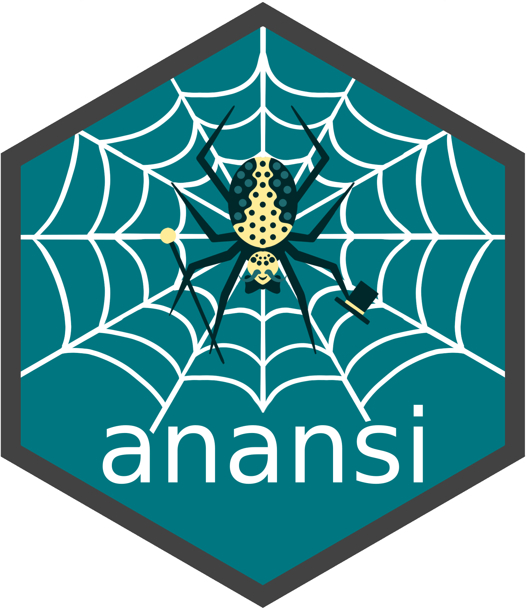

<!-- README.md is generated from README.Rmd. Please edit that file -->

```{r, include = FALSE}
knitr::opts_chunk$set(
    collapse = TRUE,
    comment = "#>",
    fig.path = "man/figures/README-",
    out.width = "100%"
)
```

# Knowledge-based multi-modal integration using anansi 

<!-- badges: start -->
[](https://github.com/thomazbastiaanssen/anansi/issues)
[](https://github.com/thomazbastiaanssen/anansi/pulls)
<!-- badges: end -->

## Introduction

The `anansi` package computes and compares the association between the features
of two 'omics data sets that are known to interact based on a database such as
KEGG. Studies including both microbiome and metabolomics data are becoming more
common. Often, it would be helpful to integrate both data sets in order to see 
if they corroborate each others patterns. All vs all association is imprecise 
and likely to yield spurious associations. This package takes a knowledge-based
approach to constrain association search space, only considering
metabolite-function interactions that have been recorded in a pathway database.
This package also provides a framework to assess differential association.

While `anansi` is geared towards metabolite-function interactions in the context
of host-microbe interactions, it is perfectly capable of handling any other pair
of data sets where some features interact canonically. 

## Installation instructions

Get the latest stable `R` release from [CRAN](http://cran.r-project.org/). Then
install `anansi` from [Bioconductor](http://bioconductor.org/) using the
following code:

```{r 'install', eval = FALSE}
if (!requireNamespace("BiocManager", quietly = TRUE)) {
    install.packages("BiocManager")
}

BiocManager::install("anansi")
```

And the development version from
[GitHub](https://github.com/thomazbastiaanssen/anansi) with `remotes`: 

```{r, 'remotes-install', eval = FALSE}
install.packages("remotes")
remotes::install_github("thomazbastiaanssen/anansi")
```
## Getting started using anansi

[See the vignettes on the package site.](https://thomazbastiaanssen.github.io/anansi/articles/anansi.html) 
Additionally, a [preprint](https://arxiv.org/abs/2305.10832) is available. 

## Citation

Below is the citation output from using `citation('anansi')` in R. 

```{r 'citation', eval = requireNamespace('anansi')}
print(citation('anansi'), bibtex = TRUE)
```

## Code of Conduct

Please note that the `anansi` project is released with a [Contributor Code of Conduct](http://bioconductor.org/about/code-of-conduct/). By contributing to 
this project, you agree to abide by its terms.
