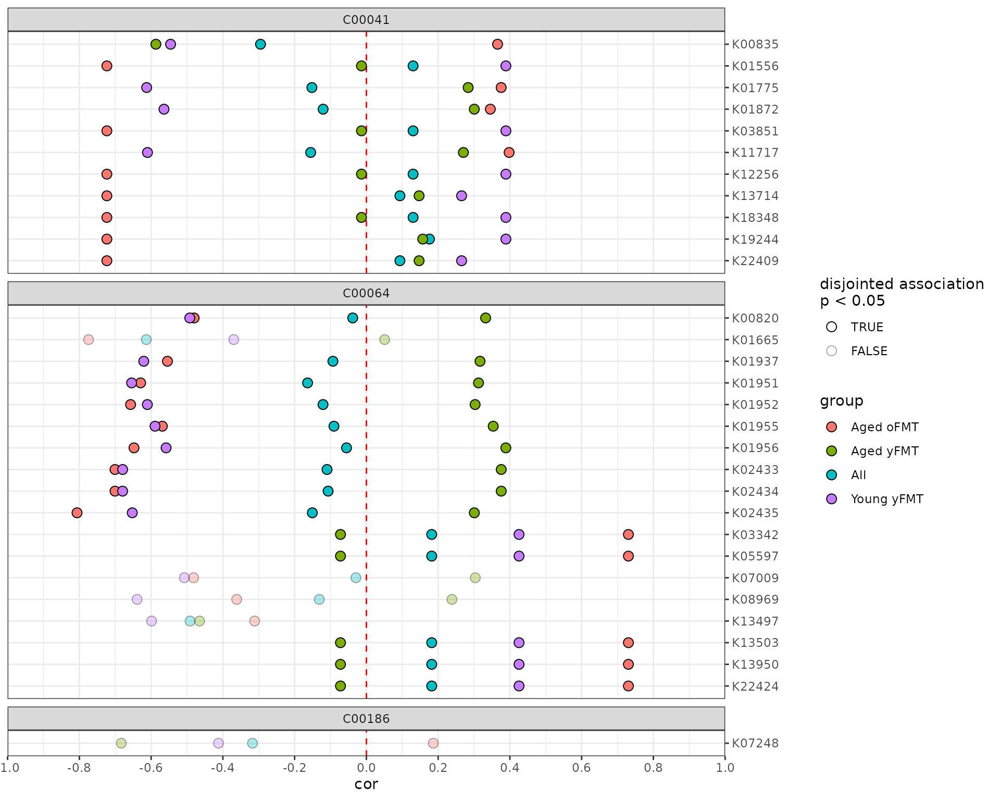
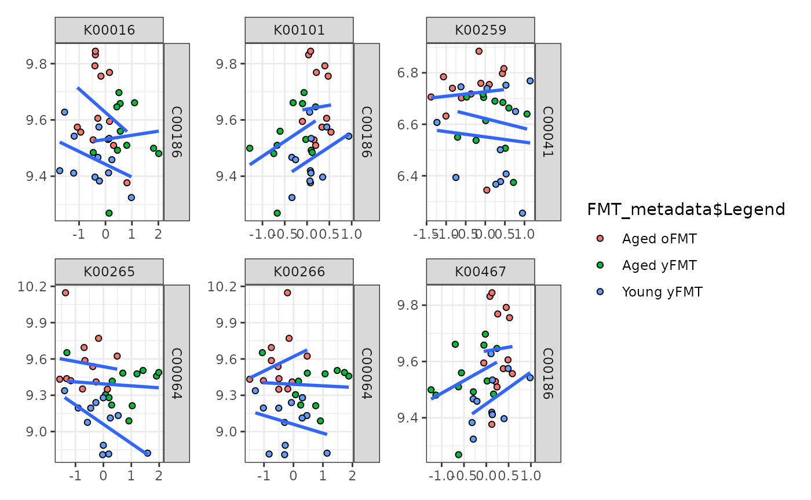

# Getting started with anansi

## Overview

This vignette can be divided into three sections:

- [Section 1](#sec-anansi-1) introduces the `anansi` framework.
- [Section 2](#sec-anansi-2) goes through a simple workflow and required
  input.
- [Section 3](#sec-anansi-3) discusses more advanced applications of
  anansi.

## Introduction

The `anansi` package computes and compares the association between the
features of two ’omics datasets that are known to interact based on a
database such as KEGG. Studies including both functional microbiome and
metabolomics data are becoming more common. Often, it would be helpful
to integrate both datasets in order to see if they corroborate each
others patterns. However, all-vs-all association analyses are imprecise
and likely to yield spurious associations. This package takes a
knowledge-based approach to constrain association search space, only
considering metabolite-function interactions that have been recorded in
a pathway database. In addition, it provides a framework to assess
differential associations.

While `anansi` is geared towards metabolite-function interactions in the
context of host-microbe interactions, it is perfectly capable of
handling any other pair of data sets where some features interact
canonically.

### A note on functional microbiome data

Two common questions in the host-microbiome field are “Who’s there?” and
“What are they doing?”. Techniques like 16S rRNA sequencing and shotgun
metagenomics sequencing are most commonly used to answer the first
question. The second question can be a bit more tricky, as it often
requires functional inference software to address them. For 16S
sequencing, programs like
[PICRUSt2](https://github.com/picrust/picrust2/) can be used to infer
function. For shotgun metagenomics, this can be done with programs such
as [HUMANn3 in the bioBakery suite](https://github.com/picrust/picrust2)
and [woltka](https://github.com/qiyunzhu/woltka). All of these
algorithms can produce functional count data in terms of KEGG
Orthologues (KOs) organised as tables, which can be directly passed to
`anansi`.

## Getting started with anansi

### Installation instructions

Get the latest stable `R` release from
[CRAN](http://cran.r-project.org/). Then install `anansi` from
[Bioconductor](http://bioconductor.org/) using the following code:

``` r

if (!requireNamespace("BiocManager", quietly = TRUE)) {
    install.packages("BiocManager")
}

BiocManager::install("anansi")
```

And the development version from
[GitHub](https://github.com/thomazbastiaanssen/anansi) with `remotes`:

``` r

install.packages("remotes")
remotes::install_github("thomazbastiaanssen/anansi")
```

### Setup

``` r

# load anansi
library(anansi)

# load ggplot2 and ggforce to plot results
library(ggplot2)
library(ggforce)

# load example data + metadata from FMT Aging study
data(FMT_data)
```

### Data preparation

The anansi framework requires input data to be prepared in a specific
format, namely the `AnansiWeb` S7 class. This is to ensure that features
are correctly linked across input datasets. We will first discuss the
required input data and then demonstrate the `weaveWeb` method, which is
the recommended way to prepare input for the anansi framework.

### Input formatting for anansi

The main `anansi` function expects data in the `AnansiWeb` class format,
which contains four tables:

#### feature tables: `tableY` and `tableX`.

The first two tables, `tableY` and `tableX` are the feature tables of
your two data modalities (e.g., metabolites, genes, microbes, …). Both
tables should have columns as features and rows as samples. Below is an
example of an appropriately formatted feature table, we will use it in
the sections below.

    ## anansi expects samples to be rows and features to be columns:

    ##              K00001      K00002      K00003      K00004
    ## PB.02.1  0.45305500 -0.02023133 -0.34911910 -0.08697995
    ## PB.02.2  0.60322048 -0.05311274 -0.36002367 -0.11986136
    ## PB.03.1  0.28627863  0.25684165 -0.04989191  0.19009303
    ## PB.03.2  1.26395782  0.12418540 -0.54208318  0.05743678
    ## PB.05.1 -0.09183481 -0.62022598  0.45770449 -0.68697460
    ## PB.05.2  0.68088279 -0.55654324  0.63207703 -0.62329186
    ## PB.06.1 -0.51986662  0.44636557 -0.16059980  0.37961695
    ## PB.06.2  0.08740716  0.52136526 -0.50323847  0.45461664
    ## PB.08.2 -0.54309849  0.20455856 -0.04633670  0.13780994
    ## PB.08.3 -0.38515537  0.38236376 -0.38668670  0.31561514

``` r

# Transpose demo tables to input format
tableY <- t(FMT_metab)
tableX <- t(FMT_KOs)
```

#### linking information: `link`.

The third table, `link`, provides the information to link the features
across the first two tables, `tableY` and `tableX`. `anansi` provides a
pre-built map between ko, cpd and ec feature annotations from the KEGG
database, but users can also provide their custom mapping information.
We will not expand on here, but [see vignette on adjacency
matrices.](https://thomazbastiaanssen.github.io/anansi/articles/adjacency_matrices.html)
Also see `?anansi::MultiFactor()`

#### Additional sample data for analysis: Metadata

The final table is `metadata`: a `data.frame` with additional
information about the data set. Its rows correspond to samples and its
columns to variables that can be used as covariates in downstream
[`anansi()`](https://thomazbastiaanssen.github.io/anansi/reference/anansi.md)
analysis.

    ## anansi expects samples to be rows and features to be columns:

    ##    Sample_ID    Legend
    ## 1    PB.02.1 Aged yFMT
    ## 2    PB.02.2 Aged yFMT
    ## 3    PB.03.1 Aged oFMT
    ## 4    PB.03.2 Aged oFMT
    ## 5    PB.05.1 Aged yFMT
    ## 6    PB.05.2 Aged yFMT
    ## 7    PB.06.1 Aged oFMT
    ## 8    PB.06.2 Aged oFMT
    ## 9    PB.08.2 Aged oFMT
    ## 10   PB.08.3 Aged oFMT

### Weave a web🕸️

The
[`weaveWeb()`](https://thomazbastiaanssen.github.io/anansi/reference/weaveWeb-generic.md)
function accepts the four input tables discussed above and collates them
into an `AnansiWeb` object. The `AnansiWeb` format is a necessary input
file for the main `anansi` workflow. It allows `anansi` to keep track of
which features from the two input data sets should be considered as
pairs.

#### Specify which features to `link`.

Additionally,
[`weaveWeb()`](https://thomazbastiaanssen.github.io/anansi/reference/weaveWeb-generic.md)
requires the user to specify the names of the feature types that should
be linked. These names need to be present as the columns of the `link`
table. In this case, we’ll link KEGG compound (cpd) to KEGG Orthologues
(ko).

``` r

# Create AnansiWeb object from tables
web <- weaveWeb(x = "ko", y = "cpd", link = kegg_link(), tableY = tableY, tableX = tableX,
    metadata = FMT_metadata)
```

    ## Dropped features in tableX: 2476 remain.

#### Specify `y`, and `x`

Though most of the examples use metabolites and functions, `anansi` is
able to handle any type of big/’omics data, as long as there is a
dictionary available. Because of this, anansi uses the type-naive
nomenclature `tableY` and `tableX`. The Y and X refer to the position
these measurements will have in the linear modeling framework:

\\ Y \sim X \times{covariates} \\

#### `weaveWeb` with Bioconductor ecosystem

As an alternative to providing input as raw tables,
[`weaveWeb()`](https://thomazbastiaanssen.github.io/anansi/reference/weaveWeb-generic.md)
also accepts the Bioconductor classes `MultiAssayExperiment` (MAE) and
`TreeSummarizedExperiment` (TSE) as input. Conversely, an `AnansiWeb`
object can be converted to a MAE or TSE with the functions
[`asMAE()`](https://thomazbastiaanssen.github.io/anansi/reference/anansi-coercion.md)
and
[`asTSE()`](https://thomazbastiaanssen.github.io/anansi/reference/anansi-coercion.md).

``` r

# Convert web to mae
mae <- asMAE(web)
```

The MAE object can be passed to the
[`weaveWeb()`](https://thomazbastiaanssen.github.io/anansi/reference/weaveWeb-generic.md)
function, which returns the same output, ready for the `anansi`
function.

``` r

web.mae <- weaveWeb(mae, tableY = "cpd", tableX = "ko", link = kegg_link())

out.mae <- anansi(web = web.mae, formula = ~Legend, adjust.method = "BH", verbose = TRUE)
```

    ## Fitting least-squares for following model:
    ## ~ x + Legend + x:Legend

    ## Running correlations for the following groups:
    ##  Aged yFMT, Aged oFMT, Young yFMT

``` r

identical(web, web.mae)
```

    ## [1] TRUE

### Run anansi🕷️

The main workspider is called `anansi` just like the package. Generally,
two main arguments should be specified:

1.  `web`: an `AnansiWeb` object, such as the one we generated in the
    above step.
2.  `formula`: a formula specifying which associations to test. For
    instance, to assess differential associations between treatments, we
    use the formula `~ Legend` (corresponding to the `Legend` column in
    the `metadata` table we provided to
    [`weaveWeb()`](https://thomazbastiaanssen.github.io/anansi/reference/weaveWeb-generic.md)
    above).

``` r

# Run anansi on AnansiWeb object
anansi_out <- anansi(web = web, formula = ~Legend, adjust.method = "BH", verbose = TRUE)
```

    ## Fitting least-squares for following model:
    ## ~ x + Legend + x:Legend

    ## Running correlations for the following groups:
    ##  Aged yFMT, Aged oFMT, Young yFMT

### Reporting output📝

By default, `anansi` outputs a table in the `wide` format. For general
reporting, we recommend sticking to the more legible `table` format by
specifying the `return.format` argument. Let’s take a look at the
structure of the output table:

``` r

# General structure of anansi() output
head(anansi_out, c(5, 5))
```

    ##   feature_Y feature_X All_r.values All_t.values All_p.values
    ## 1    C00186    K00016  -0.08985529    0.5260699   0.60225456
    ## 2    C00186    K00101   0.28661046    1.7443940   0.09012569
    ## 3    C00041    K00259  -0.21708011    1.2967052   0.20346437
    ## 4    C00064    K00265  -0.25811198    1.5578255   0.12853530
    ## 5    C00064    K00266  -0.05235448    0.3056957   0.76170027

``` r

# Let's take a look at the column names
colnames(anansi_out)
```

    ##  [1] "feature_Y"                   "feature_X"                  
    ##  [3] "All_r.values"                "All_t.values"               
    ##  [5] "All_p.values"                "Aged yFMT_r.values"         
    ##  [7] "Aged yFMT_t.values"          "Aged yFMT_p.values"         
    ##  [9] "Aged oFMT_r.values"          "Aged oFMT_t.values"         
    ## [11] "Aged oFMT_p.values"          "Young yFMT_r.values"        
    ## [13] "Young yFMT_t.values"         "Young yFMT_p.values"        
    ## [15] "full_r.squared"              "full_f.values"              
    ## [17] "full_p.values"               "disjointed_Legend_r.squared"
    ## [19] "disjointed_Legend_f.values"  "disjointed_Legend_p.values" 
    ## [21] "emergent_Legend_r.squared"   "emergent_Legend_f.values"   
    ## [23] "emergent_Legend_p.values"    "All_q.values"               
    ## [25] "Aged yFMT_q.values"          "Aged oFMT_q.values"         
    ## [27] "Young yFMT_q.values"         "full_q.values"              
    ## [29] "disjointed_Legend_q.values"  "emergent_Legend_q.values"

#### Output statistics

We can see that the output of
[`anansi()`](https://thomazbastiaanssen.github.io/anansi/reference/anansi.md)
is structured so that there is one feature pair per row, marked by the
first two columns. For each of those feature pairs, the table contains
outcome parameters from several models. In order, we have pooled
correlations, group-wise correlations, full model, disjointed and
emergent associations. For each of these models we report four
parameters. For correlations we provide the Pearson’s coefficient
(\\\rho\\) and the \\t\\-statistic, whereas we provide their squared
counterparts for the linear regression models: \\R^2\\ and the \\F\\
statistic. For all models, we additionally provide p-values and adjusted
p-values. For more on this, [see the vignette on differential
associations](https://thomazbastiaanssen.github.io/anansi/articles/differential_associations.html).

| Association | Method            | Statistics      | Significance  |
|-------------|-------------------|-----------------|---------------|
| Pooled      | Correlation       | \\\rho\\, \\t\\ | p, adjusted p |
| Group-wise  | Correlation       | \\\rho\\, \\t\\ | p, adjusted p |
| Full        | Linear regression | \\R^2\\, \\F\\  | p, adjusted p |
| Disjointed  | Linear regression | \\R^2\\, \\F\\  | p, adjusted p |
| Emergent    | Linear regression | \\R^2\\, \\F\\  | p, adjusted p |

### Plot the results

Finally, the output of `anansi` can be visualized with `plotAnansi` by
specifying the type of association to use.

``` r

# Filter associations by q value
anansi_out <- anansi_out[anansi_out$full_q.values < 0.2, ]

# Visualize disjointed associations
plotAnansi(anansi_out, association.type = "disjointed", model.var = "Legend", signif.threshold = 0.05,
    fill_by = "group")
```



## Advanced applications and customization

### Generate `AnansiWeb` with random data

The
[`randomWeb()`](https://thomazbastiaanssen.github.io/anansi/reference/randomAnansi.md)
function allows the user to generate random data, which can be useful
for statistical modeling or to generate placeholder data, for instance.

``` r

rweb <- randomWeb(n_samples = 10, n_reps = 1, n_features_x = 8, n_features_y = 12,
    sparseness = 0.5)

# The random object comes with some dummy metadata:
metadata(rweb)
```

    ##                       sample_id repeated group_ab subtype    score_a    score_b
    ## anansi_ID_sample_1_1   sample_1    rep_1        a       x  0.9721363 -0.6526750
    ## anansi_ID_sample_2_1   sample_2    rep_1        a       x  0.2589025 -0.1471693
    ## anansi_ID_sample_3_1   sample_3    rep_1        a       x  1.2074691 -1.2741013
    ## anansi_ID_sample_4_1   sample_4    rep_1        b       y -0.2694864  0.3953275
    ## anansi_ID_sample_5_1   sample_5    rep_1        a       x -0.6983068 -1.9328933
    ## anansi_ID_sample_6_1   sample_6    rep_1        a       y -1.4882559  1.0545030
    ## anansi_ID_sample_7_1   sample_7    rep_1        b       z  2.4633691 -0.8209799
    ## anansi_ID_sample_8_1   sample_8    rep_1        a       x  0.5692981 -0.6376310
    ## anansi_ID_sample_9_1   sample_9    rep_1        b       x -1.1107009 -0.1531246
    ## anansi_ID_sample_10_1 sample_10    rep_1        a       y  1.2487550 -1.4164065
    ##                            score_c
    ## anansi_ID_sample_1_1   0.607317770
    ## anansi_ID_sample_2_1   0.088392363
    ## anansi_ID_sample_3_1  -1.570274352
    ## anansi_ID_sample_4_1   0.312839820
    ## anansi_ID_sample_5_1   0.652678560
    ## anansi_ID_sample_6_1  -0.007958007
    ## anansi_ID_sample_7_1   1.727032919
    ## anansi_ID_sample_8_1   2.086467405
    ## anansi_ID_sample_9_1  -0.358345450
    ## anansi_ID_sample_10_1 -1.442124443

``` r

# also see `?randomAnansi`
```

### Apply user-defined function on each pair of features

A typical `anansi` workflow, as the one above, estimates associations
between each pair of features. More generally, we can use
[`pairwiseApply()`](https://thomazbastiaanssen.github.io/anansi/reference/pairwiseApply.md)
on the same `AnansiWeb` input object to apply a user-defined function on
each pair of features. The function passes as the `FUN` argument is
applied on each pair of features, which are pre-mapped to `y` and `x`:
`function(x, y)`. [Also see vignette on adjacency
matrices.](https://thomazbastiaanssen.github.io/anansi/articles/adjacency_matrices.html)

``` r

# For each feature pair, was the value for x higher than the value for y?
pairwise_gt <- pairwiseApply(X = web, FUN = function(x, y) x > y, USE.NAMES = TRUE)

pairwise_gt[1:5, 1:5]
```

    ##      K00016C00186 K00101C00186 K00259C00041 K00265C00064 K00266C00064
    ## [1,]        FALSE        FALSE        FALSE        FALSE        FALSE
    ## [2,]        FALSE        FALSE        FALSE        FALSE        FALSE
    ## [3,]        FALSE        FALSE        FALSE        FALSE        FALSE
    ## [4,]        FALSE        FALSE        FALSE        FALSE        FALSE
    ## [5,]        FALSE        FALSE        FALSE        FALSE        FALSE

``` r

# Run cor() on each pair of features
pairwise_cor <- pairwiseApply(X = web, FUN = function(x, y) cor(x, y), USE.NAMES = FALSE)

pairwise_cor
```

    ##  [1] -0.089855287  0.286610462 -0.217080108 -0.258111984 -0.052354476
    ##  [6]  0.292482963 -0.293393854 -0.120364874 -0.038092478 -0.295031893
    ## [11] -0.021200394 -0.023151942  0.025228541 -0.148763930  0.130218387
    ## [16] -0.229947380 -0.171094273 -0.334244907 -0.613425736 -0.151876683
    ## [21] -0.120573951 -0.121691812 -0.104470818 -0.082729042 -0.093298286
    ## [26] -0.278488810 -0.163905208 -0.120866212  0.084127445 -0.090397753
    ## [31] -0.055348860  0.020167534  0.020167534 -0.109658186 -0.106645318
    ## [36] -0.150684621 -0.142237985 -0.143196278  0.182100284 -0.014849022
    ## [41]  0.130218387 -0.010639602  0.182100284 -0.090839048 -0.029284902
    ## [46] -0.317444393 -0.090842763 -0.131210903 -0.000911579 -0.133926855
    ## [51]  0.106084123 -0.155249441  0.130218387 -0.491307315  0.182100284
    ## [56]  0.093482699  0.182100284 -0.212631125  0.292482963  0.130218387
    ## [61]  0.175711737  0.160646846 -0.214205556  0.093482699  0.182100284

### Plotting examples

Automatic plotting functions such as
[`plotAnansi()`](https://thomazbastiaanssen.github.io/anansi/reference/plotAnansi.md)
provide a convenient and code-light solution to visualization. However,
some may prefer interfacing directly with the
[`ggplot()`](https://ggplot2.tidyverse.org/reference/ggplot.html) code.
We provide code to recreate the above figure:

``` r

# Use tidyr to wrangle the correlation r-values to a single column
library(tidyr)

anansiLong <- anansi_out |>
    pivot_longer(starts_with("All") | contains("FMT")) |>
    separate_wider_delim(
        name,
        delim = "_", names = c("cor_group", "param")
    ) |>
    pivot_wider(names_from = param, values_from = value)

# Now it's ready to be plugged into ggplot2, though let's clean up a bit more.
# Only consider interactions where the entire model fits well enough.
anansiLong <- anansiLong[anansiLong$full_q.values < 0.2, ]

ggplot(anansiLong) +

    # Define aesthetics
    aes(
        x = r.values,
        y = feature_X,
        fill = cor_group,
        alpha = disjointed_Legend_p.values < 0.05
    ) +

    # Make a vertical dashed red line at x = 0
    geom_vline(xintercept = 0, linetype = "dashed", colour = "red") +

    # Points show  raw correlation coefficients
    geom_point(shape = 21, size = 3) +

    # facet per compound
    ggforce::facet_col(~feature_Y, space = "free", scales = "free_y") +

    # fix the scales, labels, theme and other layout
    scale_y_discrete(limits = rev, position = "right") +
    scale_alpha_manual(
        values = c("TRUE" = 1, "FALSE" = 1 / 3),
        "Disjointed association\np < 0.05"
    ) +
    scale_fill_manual(
        values = c(
            "Young yFMT" = "#2166ac",
            "Aged oFMT" = "#b2182b",
            "Aged yFMT" = "#ef8a62",
            "All" = "gray"
        ),
        breaks = c("Young yFMT", "Aged oFMT", "Aged yFMT", "All"),
        name = "Treatment"
    ) +
    theme_bw() +
    ylab("") +
    xlab("Pearson's \u03c1")
```


### Plotting multiple feature pairs at once with patchwork

We can also also use the `AnansiWeb` object to pull up specific pairs of
features. The [`patchwork`](https://patchwork.data-imaginist.com/)
provides a wonderful interface to combine plots. We can use
[`getFeaturePairs()`](https://thomazbastiaanssen.github.io/anansi/reference/getFeaturePairs.md)
to extract the relevant data from our `AnansiWeb` object in a convenient
list format:

``` r

library(patchwork)

# Get a list containing data.frames for each feature pair.
feature_pairs <- getFeaturePairs(web)

# For each, prepare a ggplot object with those features on x & y axes.
plot_list <- lapply(
    feature_pairs,
    FUN = function(pair_i) {
        ggplot(pair_i) +
            aes(
                y = .data[[colnames(pair_i)[1L]]],
                x = .data[[colnames(pair_i)[2L]]]
            ) +
            # We'll use facet_grid for labels instead of labs().
            facet_grid(colnames(pair_i)[1L] ~ colnames(pair_i)[2L])
    }
)

# Feed the first six of our ggplots to patchwork, using wrap_plots()
wrap_plots(plot_list[seq_len(6L)], guides = "collect") &
    # Continue as with an ordinary ggplot, but use & instead of +
    geom_point(
        shape = 21, show.legend = FALSE,
        aes(fill = FMT_metadata$Legend)
    ) &
    geom_smooth(
        method = "lm", se = FALSE,
        aes(colour = FMT_metadata$Legend),
        show.legend = FALSE
    ) &

    # Appearance
    scale_fill_manual(
        aesthetics = c("colour", "fill"),
        values = c(
            "Young yFMT" = "#2166ac",
            "Aged oFMT" = "#b2182b",
            "Aged yFMT" = "#ef8a62",
            "All" = "gray"
        )
    ) &
    theme_bw() &
    labs(x = NULL, y = NULL)
```



These types of visualizations of feature pairs work best when the amount
of feature pairs to be plotted is modest.

#### Note on using `patchwork` with `anansi`:

Especially for large numbers of feature pairs, it’s much more efficient
to add shared elements to the patchwork using the `&` operator, rather
than adding them to the initial
[`ggplot()`](https://ggplot2.tidyverse.org/reference/ggplot.html) calls
in the [`lapply()`](https://rdrr.io/r/base/lapply.html) loop.

## Session info

``` r

sessionInfo()
```

    ## R version 4.6.1 (2026-06-24)
    ## Platform: x86_64-pc-linux-gnu
    ## Running under: Ubuntu 24.04.4 LTS
    ## 
    ## Matrix products: default
    ## BLAS:   /usr/lib/x86_64-linux-gnu/openblas-pthread/libblas.so.3 
    ## LAPACK: /usr/lib/x86_64-linux-gnu/openblas-pthread/libopenblasp-r0.3.26.so;  LAPACK version 3.12.0
    ## 
    ## locale:
    ##  [1] LC_CTYPE=en_US.UTF-8       LC_NUMERIC=C              
    ##  [3] LC_TIME=en_US.UTF-8        LC_COLLATE=en_US.UTF-8    
    ##  [5] LC_MONETARY=en_US.UTF-8    LC_MESSAGES=en_US.UTF-8   
    ##  [7] LC_PAPER=en_US.UTF-8       LC_NAME=C                 
    ##  [9] LC_ADDRESS=C               LC_TELEPHONE=C            
    ## [11] LC_MEASUREMENT=en_US.UTF-8 LC_IDENTIFICATION=C       
    ## 
    ## time zone: UTC
    ## tzcode source: system (glibc)
    ## 
    ## attached base packages:
    ## [1] stats     graphics  grDevices utils     datasets  methods   base     
    ## 
    ## other attached packages:
    ## [1] patchwork_1.3.2  tidyr_1.3.2      ggforce_0.5.0    ggplot2_4.0.3   
    ## [5] anansi_0.99.4    BiocStyle_2.41.0
    ## 
    ## loaded via a namespace (and not attached):
    ##  [1] tidyselect_1.2.1                viridisLite_0.4.3              
    ##  [3] dplyr_1.2.1                     farver_2.1.2                   
    ##  [5] viridis_0.6.5                   Biostrings_2.81.5              
    ##  [7] S7_0.2.2                        ggraph_2.2.2                   
    ##  [9] fastmap_1.2.0                   SingleCellExperiment_1.35.2    
    ## [11] lazyeval_0.2.3                  tweenr_2.0.3                   
    ## [13] digest_0.6.39                   lifecycle_1.0.5                
    ## [15] tidytree_0.4.8                  magrittr_2.0.5                 
    ## [17] compiler_4.6.1                  rlang_1.3.0                    
    ## [19] sass_0.4.10                     tools_4.6.1                    
    ## [21] igraph_2.3.3                    yaml_2.3.12                    
    ## [23] knitr_1.51                      labeling_0.4.3                 
    ## [25] graphlayouts_1.2.4              S4Arrays_1.13.0                
    ## [27] htmlwidgets_1.6.4               DelayedArray_0.39.3            
    ## [29] RColorBrewer_1.1-3              TreeSummarizedExperiment_2.21.0
    ## [31] abind_1.4-8                     BiocParallel_1.47.0            
    ## [33] withr_3.0.3                     purrr_1.2.2                    
    ## [35] BiocGenerics_0.59.10            desc_1.4.3                     
    ## [37] grid_4.6.1                      polyclip_1.10-7                
    ## [39] stats4_4.6.1                    scales_1.4.0                   
    ## [41] MASS_7.3-66                     MultiAssayExperiment_1.39.0    
    ## [43] SummarizedExperiment_1.43.0     cli_3.6.6                      
    ## [45] rmarkdown_2.31                  crayon_1.5.3                   
    ## [47] ragg_1.5.2                      treeio_1.37.0                  
    ## [49] generics_0.1.4                  otel_0.2.0                     
    ## [51] ape_5.8-1                       cachem_1.1.0                   
    ## [53] stringr_1.6.0                   splines_4.6.1                  
    ## [55] parallel_4.6.1                  formatR_1.14                   
    ## [57] BiocManager_1.30.27             XVector_0.53.0                 
    ## [59] matrixStats_1.5.0               vctrs_0.7.3                    
    ## [61] yulab.utils_0.2.4               Matrix_1.7-5                   
    ## [63] jsonlite_2.0.0                  bookdown_0.47                  
    ## [65] IRanges_2.47.2                  S4Vectors_0.51.5               
    ## [67] ggrepel_0.9.8                   systemfonts_1.3.2              
    ## [69] jquerylib_0.1.4                 glue_1.8.1                     
    ## [71] pkgdown_2.2.1                   codetools_0.2-20               
    ## [73] stringi_1.8.7                   gtable_0.3.6                   
    ## [75] GenomicRanges_1.65.1            tibble_3.3.1                   
    ## [77] pillar_1.11.1                   rappdirs_0.3.4                 
    ## [79] htmltools_0.5.9                 Seqinfo_1.3.0                  
    ## [81] R6_2.6.1                        textshaping_1.0.5              
    ## [83] tidygraph_1.3.1                 evaluate_1.0.5                 
    ## [85] lattice_0.22-9                  Biobase_2.73.1                 
    ## [87] memoise_2.0.1                   bslib_0.11.0                   
    ## [89] Rcpp_1.1.2                      gridExtra_2.3.1                
    ## [91] SparseArray_1.13.2              nlme_3.1-170                   
    ## [93] mgcv_1.9-4                      xfun_0.60                      
    ## [95] fs_2.1.0                        MatrixGenerics_1.25.0          
    ## [97] forcats_1.0.1                   pkgconfig_2.0.3
